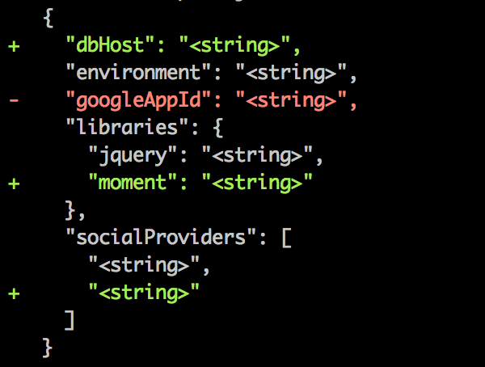
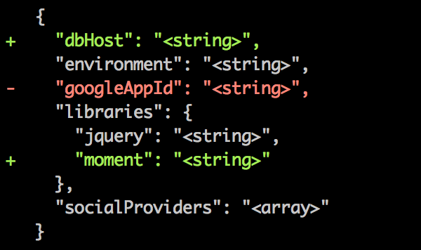

# diff-json-structure [](https://travis-ci.org/IndigoUnited/node-diff-json-structure)

Get the structural diff of two JSON objects, using [diff](https://github.com/kpdecker/jsdiff)'s internally which is a module used by several test frameworks.


It is considered a structural difference whenever:

  - items are added or removed to objects and arrays
  - the type of the item changes


## Installation

`$ npm install diff-json-structure`


## Usage

`diff(oldObj, newObj, [options])`

Calculates the structural diff between `oldObj` and `newObj`, returning an array of parts.

Available options:

- typeMapper - A function that lets you override types for specific paths
- .. and any option that [diff](https://github.com/kpdecker/jsdif)'s `.diffJson()` method supports


### Examples

Simple usage:

```js
var diff = require('diff-json-structure');
var chalk = require('chalk');

// Utility function to visually print the diff
// Tweak it at your own taste
function printDiff(parts) {
    parts.forEach(function (part) {
        part.value
        .split('\n')
        .filter(function (line) { return !!line; })
        .forEach(function (line) {
            if (part.added) {
                process.stdout.write(chalk.green('+  ' + line) + '\n');
            } else if (part.removed) {
                process.stdout.write(chalk.red('-  ' + line) + '\n');
            } else {
                process.stdout.write(chalk.dim('   ' + line) + '\n');
            }
        });
    });

    process.stdout.write('\n');
}

var oldObject = {
    environment: 'dev',
    googleAppId: 'UA-3234432-22',
    socialProviders: ['facebook'],
    libraries: {
        jquery: './node_modules/jquery',
    },
};

var newObj = {
    environment: 'prod',
    dbHost: '127.0.0.1:9000',
    socialProviders: ['facebook', 'twitter'],
    libraries: {
        jquery: './node_modules/jquery/jquery',
        moment: './node_modules/moment/moment',
    },
};

printDiff(diff(oldObj, newObj));
```




Usage with `options.typeMapper` to ignore differences of socialProvider items of the previous example:

```js
printDiff(diff(oldObj, newObj, {
    typeMapper: function (path, value, prop, subject) {
        // path is a string that contains the full path to this value
        // e.g.: 'libraries.jquery' and 'socialProviders[0]'

        // You may return custom types here.. if nothing is returned, the normal
        // flow of identifying the structure recursively will continue
        if (path === 'socialProviders') {
            return 'array';
        }
    },
}));
```




## Tests

`$ npm test`


## License

Released under the [MIT License](http://www.opensource.org/licenses/mit-license.php).
